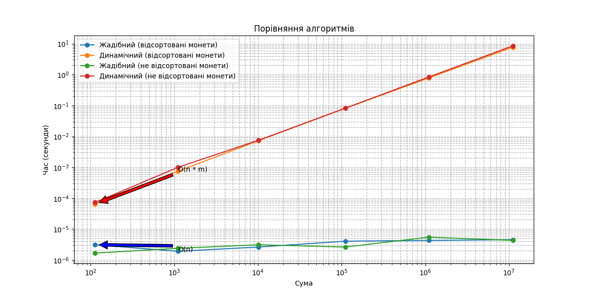

# goit-algo-hw-09
## Тема 9. Жадібні алгоритми та динамічне програмування

Перед початком роботи:
1. Версія **Python: >=3.10**
2. Cтворюємо віртуальне середовище (Python: >=3.10) `.env`: `python -m venv .env`
3. Активуємо (відповідно до своєї ОС): `source .env/bin/activate`
4. Інсталюємо залежності: `pip install -r requirements.txt`
5. По завершенню роботи деактивовуємо: `deactivate`

## Завдання
У конспекті ми розглянули приклад про розбиття суми на монети. Маємо набір монет `[50, 25, 10, 5, 2, 1]`. Уявіть, що ви розробляєте систему для касового апарату, яка повинна визначити оптимальний спосіб видачі решти покупцеві.

Вам необхідно написати дві функції для касової системи, яка видає решту покупцеві:
1. Функція жадібного алгоритму `find_coins_greedy`. Ця функція повинна приймати суму, яку потрібно видати покупцеві, і повертати словник із кількістю монет кожного номіналу, що використовуються для формування цієї суми. Наприклад, для суми `113` це буде словник `{50: 2, 10: 1, 2: 1, 1: 1}`. Алгоритм повинен бути жадібним, тобто спочатку вибирати найбільш доступні номінали монет.
2. Функція динамічного програмування `find_min_coins`. Ця функція також повинна приймати суму для видачі решти, але використовувати метод динамічного програмування, щоб знайти мінімальну кількість монет, необхідних для формування цієї суми. Функція повинна повертати словник із номіналами монет та їх кількістю для досягнення заданої суми найефективнішим способом. Наприклад, для суми `113` це буде словник `{1: 1, 2: 1, 10: 1, 50: 2}`.
Порівняйте ефективність жадібного алгоритму та алгоритму динамічного програмування, базуючись на часі їх виконання або О великому та звертаючи увагу на їхню продуктивність при великих сумах. Висвітліть, як вони справляються з великими сумами та чому один алгоритм може бути більш ефективним за інший у певних ситуаціях. Свої висновки додайте у файл readme.md домашнього завдання.

### Критерії оцінювання:
- Програмно реалізовано функцію, яка використовує принцип жадібного алгоритму. Код виконується і повертає словник з кількістю монет кожного номіналу, що використовуються для формування певної суми. Спочатку вибираються найбільш доступні номінали монет.
- Програмно реалізовано функцію, яка використовує принцип динамічного програмування. Код виконується і повертає словник з номіналами монет та їх кількістю для досягнення заданої суми найефективнішим способом.
- На основі оцінювання часу виконання кожного з двох алгоритмів або `О` великого визначено найбільш ефективний при великих сумах алгоритм.
- Зроблено висновки щодо ефективності алгоритмів для даного випадку. Висновки оформлено у вигляді файлу readme.md домашнього завдання.

## Порівняння ефективності алгоритмів
### Жадібний алгоритм
Жадібний алгоритм вибирає найбільший номінал монети, який не перевищує залишок суми, поки сума не зменшиться до нуля. Цей алгоритм має часову складність $O(n)$, де $n$ - кількість номіналів монет.
### Алгоритм динамічного програмування
Алгоритм динамічного програмування будує рішення, розв'язуючи підзадачі та комбінуючи їхні рішення. Він має часову складність $O(n \cdot m)$, де $n$ - сума, а $m$ - кількість номіналів монет.
## Результати
Результати порівняння візуалізовані у файлі `algorithm_efficiency_comparison.png`. Час виконання для відсортованих та не відсортованих номіналів монет вимірювався для різних сум.
### Спостереження

1. **Жадібний алгоритм**:
    - **Часова складність**: $O(n)$
    - **Продуктивність**: Жадібний алгоритм добре працює для великих сум, коли номінали монет відсортовані. Він ефективний і швидкий завдяки своїй лінійній часовій складності.
    - **Обмеження**: Жадібний алгоритм не завжди може надати оптимальне рішення для всіх наборів номіналів монет.
2. **Алгоритм динамічного програмування**:
    - **Часова складність**: $O(n \cdot m)$
    - **Продуктивність**: Алгоритм динамічного програмування гарантує оптимальне рішення для будь-якого набору номіналів монет. Однак, час його виконання значно збільшується з більшими сумами через вищу часову складність.
    - **Переваги**: Він більш універсальний і надійний для знаходження мінімальної кількості монет.

### Відсортовані vs. Не відсортовані номінали монет
- **Відсортовані номінали**: Обидва алгоритми працюють краще з відсортованими номіналами монет. Жадібний алгоритм, зокрема, значно виграє від відсортованого вводу.
- **Не відсортовані номінали**: Продуктивність алгоритму динамічного програмування менше залежить від порядку номіналів монет, але він все одно працює краще з відсортованим вводом.
## Висновок
- Жадібний алгоритм більш ефективний для великих сум, коли номінали монет відсортовані, але він не завжди може надати оптимальне рішення.
- Алгоритм динамічного програмування більш надійний для знаходження оптимального рішення, але він менш ефективний для великих сум через вищу часову складність.
- Для практичного застосування вибір алгоритму залежить від конкретних вимог: якщо оптимальність є критичною, перевага надається алгоритму динамічного програмування; якщо важлива швидкість і номінали монет відсортовані, жадібний алгоритм є кращим вибором.
# Візуалізація
Час виконання обох алгоритмів зображено на логарифмічній шкалі у файлі `algorithm_efficiency_comparison.png`. Графік містить анотації, що вказують на часові складності алгоритмів.

### Ресурси
- [task1.py](./task1.py)
- [algorithm_efficiency_comparison.png](./algorithm_efficiency_comparison.png)

## Додатково
- [Домашнє завдання до теми "Жадібні алгоритми та динамічне програмування"](https://www.edu.goit.global/uk/learn/24858703/19646173/19658335/homework)
- [https://github.com/nickolas-z/goit-algo-hw-09](https://github.com/nickolas-z/goit-algo-hw-09)
- [goit-algo-hw-09-main.zip](https://s3.eu-north-1.amazonaws.com/lms.goit.files/3786fe40-7e5a-4a09-adcb-adcedcaf0e5c%D0%94%D0%979_%D0%97%D1%83%D0%B1%D1%87%D0%B8%D0%BA%D0%9C%D0%B8%D0%BA%D0%BE%D0%BB%D0%B0%D0%9C%D0%B8%D0%BA%D0%BE%D0%BB%D0%B0%D0%B9%D0%BE%D0%B2%D0%B8%D1%87.zip)
- [Basic-Algorithms-and-Data-Structures-Neoversity](https://github.com/nickolas-z/Basic-Algorithms-and-Data-Structures-Neoversity)